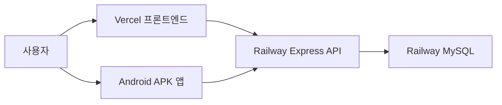
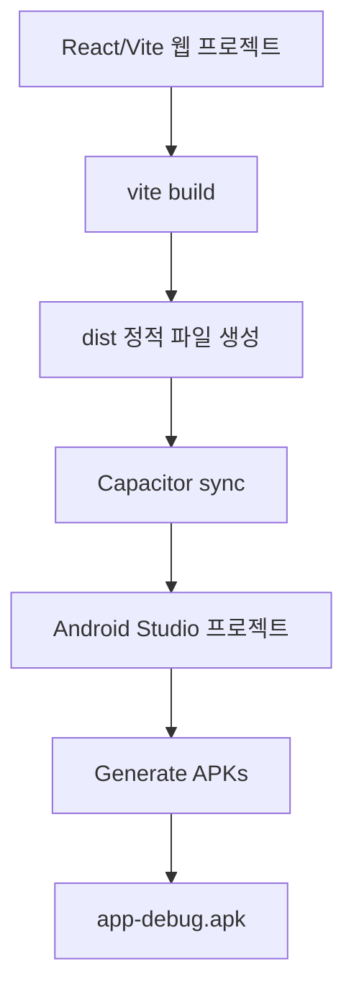
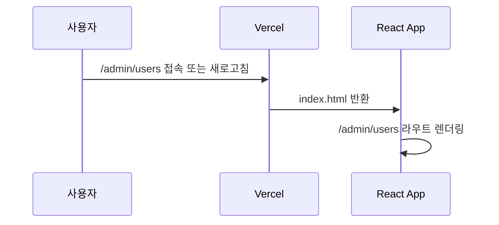
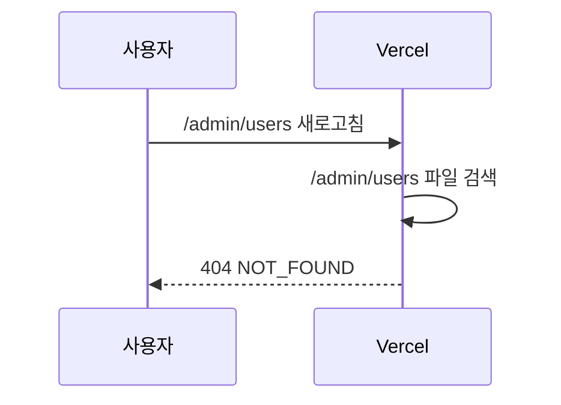
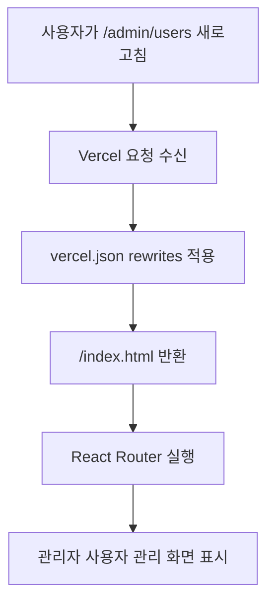

# HomeShop 웹 앱 변환 및 Vercel 404 오류 패치 리포트

작성일: 2026-07-02

## 1. 리포트 목적

이 문서는 기존 HomeShop 웹사이트를 안드로이드 APK 앱으로 만드는 과정과, Vercel 배포 후 새로고침 시 발생한 `404 NOT_FOUND` 오류의 원인 및 패치 방법을 정리한 문서다.

현재 프로젝트 기준 경로는 다음과 같다.

```text
D:\LOGIN
├─ backend
└─ frontend
```

운영 배포 주소는 다음과 같다.

```text
프론트엔드: https://homeshop-three.vercel.app
백엔드 API: https://homeshop-production.up.railway.app/api
백엔드 상태 확인: https://homeshop-production.up.railway.app/api/health
```

## 2. 전체 구조



웹과 앱은 같은 백엔드 API를 사용한다. 웹은 Vercel 주소에서 실행되고, 앱은 안드로이드 WebView 안에서 Capacitor 기반으로 실행된다.

## 3. 웹을 APK 앱으로 만든 과정

### 3.1 사용한 방식

웹을 앱으로 만드는 방식은 `Capacitor`를 사용했다.

Capacitor는 React/Vite로 만든 웹 화면을 안드로이드 앱 안의 WebView에 넣어 APK로 빌드할 수 있게 해주는 도구다.



### 3.2 설치한 패키지

프론트엔드 폴더에서 Capacitor 패키지를 설치했다.

```powershell
cd D:\LOGIN\frontend
npm install @capacitor/core @capacitor/cli @capacitor/android
```

설치 후 `package.json`에 Capacitor 관련 의존성이 추가되었다.

```json
{
  "@capacitor/android": "^8.4.1",
  "@capacitor/cli": "^8.4.1",
  "@capacitor/core": "^8.4.1"
}
```

### 3.3 Capacitor 초기화

앱 이름과 앱 ID를 지정했다.

```powershell
cd D:\LOGIN\frontend
npx cap init HomeShop com.water11y.homeshop --web-dir=dist
```

생성된 설정 파일은 다음과 같다.

```text
D:\LOGIN\frontend\capacitor.config.json
```

내용은 다음과 같다.

```json
{
  "appId": "com.water11y.homeshop",
  "appName": "HomeShop",
  "webDir": "dist"
}
```

### 3.4 운영 API 주소 설정

APK 안에 들어가는 웹 화면도 운영 백엔드 API를 바라봐야 한다. 그래서 프론트엔드 운영 환경 파일을 만들었다.

```text
D:\LOGIN\frontend\.env.production
```

내용:

```env
VITE_API_URL=https://homeshop-production.up.railway.app/api
```

이 설정이 없거나 잘못되어 있으면 APK가 `localhost` API를 찾으려고 해서 회원가입/로그인이 실패할 수 있다.

### 3.5 Android 프로젝트 생성

Capacitor로 Android 프로젝트를 생성했다.

```powershell
cd D:\LOGIN\frontend
npm run build
npx cap add android
```

생성된 Android 프로젝트 경로:

```text
D:\LOGIN\frontend\android
```

### 3.6 Android Studio 설치 및 SDK 설정

Android Studio를 설치하고 다음 SDK 구성 요소를 설치했다.

```text
Android SDK Platform
Android SDK Build-Tools
Android SDK Platform-Tools
Android Emulator 관련 구성 요소
```

SDK 설치 중 `Connect timed out` 오류가 발생했지만 `Retry`를 눌러 재시도했고, 설치가 완료되었다.

설치 완료 후 Android Studio에서 다음 폴더를 열었다.

```text
D:\LOGIN\frontend\android
```

### 3.7 APK 생성

Android Studio에서 다음 메뉴를 사용했다.

```text
Build
→ Generate App Bundles or APKs
→ Generate APKs
```

빌드 성공 후 APK가 생성되었다.

APK 위치:

```text
D:\LOGIN\frontend\android\app\build\outputs\apk\debug\app-debug.apk
```

이 APK는 테스트용 디버그 APK다. 휴대폰에 직접 옮겨 설치할 수 있다.

## 4. APK 앱에서 Failed to fetch가 발생한 이유

APK 설치 후 앱에서 회원가입 또는 로그인을 시도했을 때 `Failed to fetch`가 발생했다.

이 문제는 보통 두 가지 원인 중 하나다.

```text
1. APK 안의 API 주소가 localhost로 들어간 경우
2. 백엔드 CORS 설정이 앱의 Origin을 허용하지 않는 경우
```

확인 결과 APK 안의 API 주소는 정상적으로 운영 API를 보고 있었다.

```text
https://homeshop-production.up.railway.app/api
```

따라서 원인은 CORS 허용 목록에 안드로이드 앱의 Origin이 없었던 것이다.

웹 브라우저에서 접속할 때 Origin은 다음과 비슷하다.

```text
https://homeshop-three.vercel.app
```

하지만 Capacitor 앱에서 접속할 때 Origin은 다음과 비슷하다.

```text
capacitor://localhost
http://localhost
https://localhost
```

백엔드가 이 Origin을 허용하지 않으면 앱에서 API 요청이 차단되고, 프론트엔드에는 `Failed to fetch`가 표시된다.

### 패치 방법

Railway 백엔드 서비스 `homeshop`의 환경변수 `CLIENT_ORIGIN`에 앱 Origin을 추가한다.

```env
CLIENT_ORIGIN=https://homeshop-three.vercel.app,http://localhost:5173,http://localhost:5174,capacitor://localhost,http://localhost,https://localhost
```

설정 후 Railway 백엔드를 재배포 또는 재시작한다.

## 5. Vercel 새로고침 404 오류

### 5.1 발생 현상

Vercel 배포 사이트에서 아래 주소를 직접 열거나 새로고침하면 `404 NOT_FOUND`가 발생했다.

```text
https://homeshop-three.vercel.app/admin/users
```

화면에는 다음과 같은 메시지가 표시되었다.

```text
404: NOT_FOUND
Code: NOT_FOUND
```

### 5.2 원인

HomeShop 프론트엔드는 React Router를 사용하는 SPA다.

SPA에서는 `/admin/users`, `/products/1`, `/orders` 같은 주소가 실제 서버 파일이 아니라 React 내부 라우트다.

정상 흐름은 다음과 같다.



하지만 패치 전에는 Vercel이 `/admin/users`라는 실제 파일이나 폴더를 찾으려고 했다.



즉, React Router 문제가 아니라 Vercel 정적 호스팅 라우팅 설정 문제였다.

### 5.3 패치 파일

다음 파일을 추가했다.

```text
D:\LOGIN\frontend\vercel.json
```

내용:

```json
{
  "rewrites": [
    {
      "source": "/(.*)",
      "destination": "/index.html"
    }
  ]
}
```

### 5.4 패치 원리

이 설정은 Vercel에게 이렇게 알려준다.

```text
어떤 주소로 들어오든 일단 index.html을 반환해라.
그 다음 실제 화면 전환은 React Router가 처리한다.
```

패치 후 흐름은 다음과 같다.



### 5.5 배포 방법

수정 파일을 GitHub에 커밋하고 푸시했다.

```powershell
git add frontend/vercel.json
git commit -m "Fix Vercel SPA refresh routing"
git push
```

커밋:

```text
638c8aa Fix Vercel SPA refresh routing
```

GitHub에 푸시되면 Vercel이 자동으로 다시 배포한다. 배포 성공 후 `/admin/users` 같은 내부 주소에서 새로고침해도 404가 발생하지 않아야 한다.

## 6. 문제별 빠른 점검표

### 앱에서 회원가입/로그인이 안 될 때

```text
1. 프론트엔드 .env.production 확인
2. VITE_API_URL이 Railway API 주소인지 확인
3. npm run build 실행
4. npx cap sync android 실행
5. Android Studio에서 APK 재생성
6. Railway CLIENT_ORIGIN에 capacitor://localhost 포함 여부 확인
7. 백엔드 재배포 또는 재시작
8. 앱 완전 종료 후 다시 실행
```

### 웹에서 새로고침 404가 뜰 때

```text
1. frontend/vercel.json 존재 여부 확인
2. rewrites 설정이 /index.html로 되어 있는지 확인
3. GitHub에 커밋/푸시했는지 확인
4. Vercel 배포가 성공했는지 확인
5. 브라우저 캐시 새로고침 후 다시 테스트
```

## 7. 현재 결과

현재 완료된 작업은 다음과 같다.

```text
웹 배포: 성공
백엔드 배포: 성공
MySQL 연결: 성공
Android Studio 설치: 성공
APK 생성: 성공
Vercel 새로고침 404 패치: 완료
앱 로그인 CORS 원인 파악: 완료
```

## 8. 다음 단계

다음에 진행할 수 있는 작업은 다음과 같다.

```text
1. Railway CLIENT_ORIGIN 최종 확인
2. APK 로그인/회원가입 재테스트
3. release APK 생성
4. 앱 서명키 생성
5. Play Store 배포용 AAB 생성
6. GitHub Releases에 APK 업로드
7. 다운로드 페이지 또는 QR 코드 제공
```

디버그 APK는 테스트용이다. 다른 사용자에게 안정적으로 배포하려면 release APK 또는 Play Store용 AAB를 만들어야 한다.
